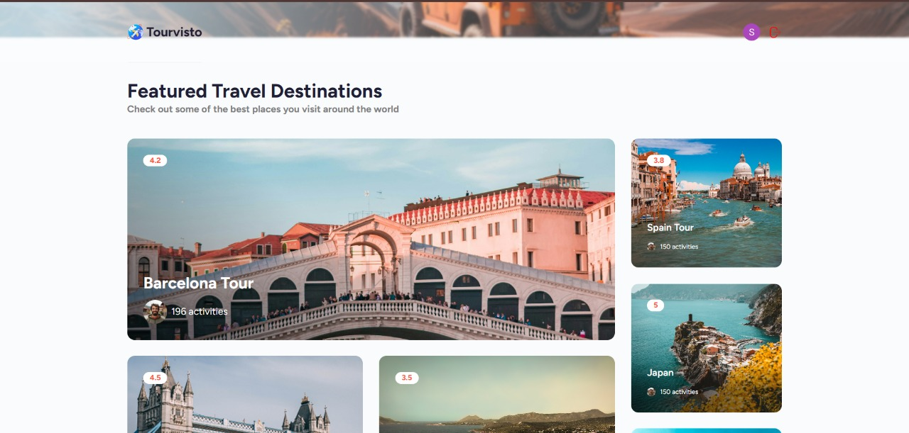
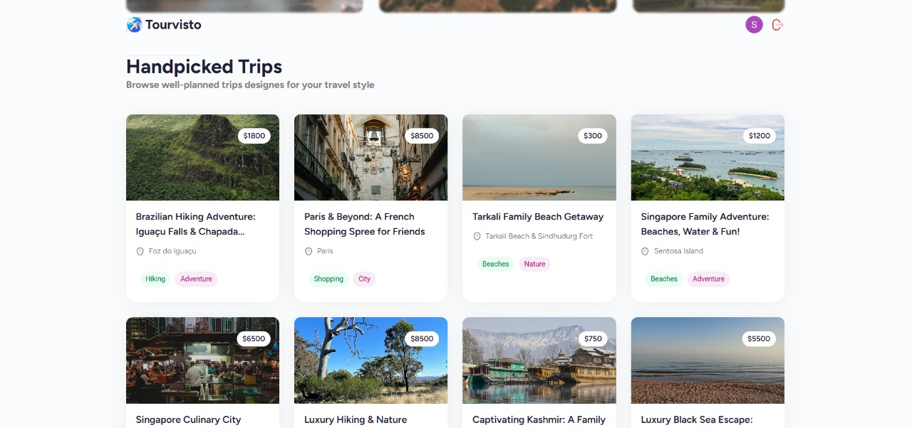
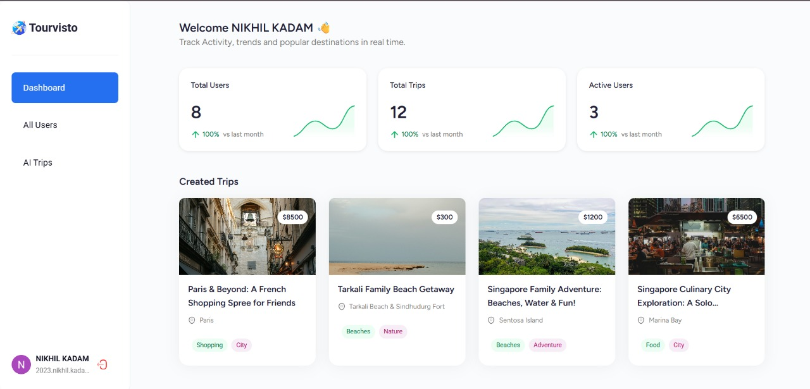
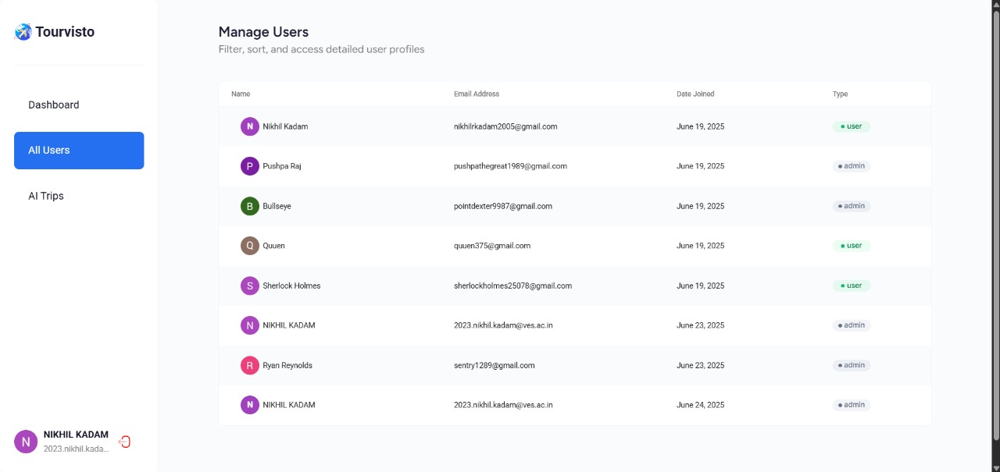
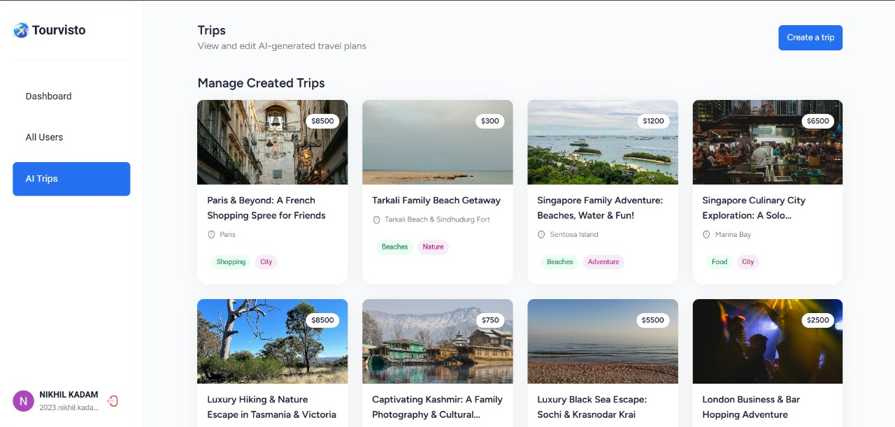
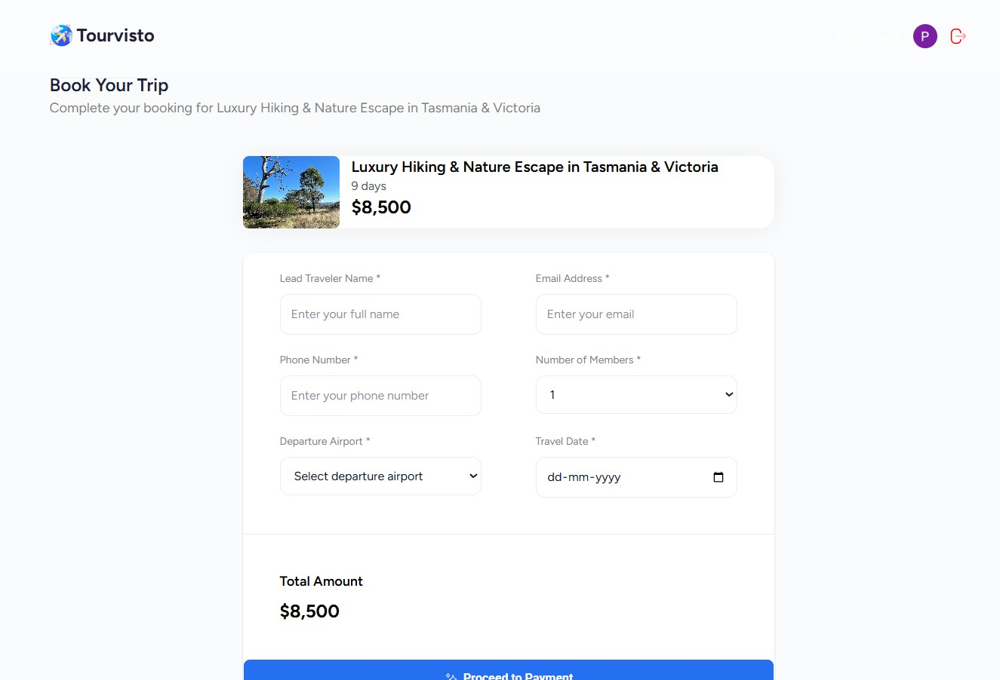
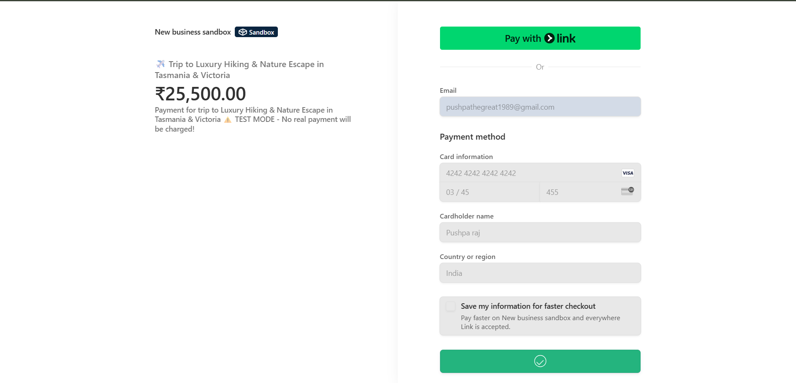
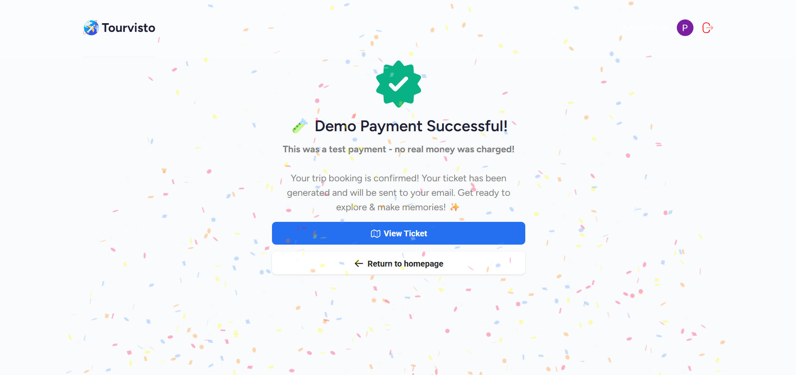

# 🌍 Tourvisto - Where Dreams Meet Destinations ✈️

<div align="center">
  
  
  [](https://reactjs.org/)
  [](https://www.typescriptlang.org/)
  [](https://vitejs.dev/)
  [](https://appwrite.io/)
  [](https://stripe.com/)
  
  <h3>🎯 <em>Revolutionizing Travel Management with Cutting-Edge Technology</em> 🎯</h3>
  
  <p>
    <strong>🚀 Experience the Future of Travel Planning</strong><br/>
    Built for wanderers, dreamers, and adventure seekers worldwide!
  </p>
</div>

---

## 🎭 **What Makes Tourvisto EXTRAORDINARY?**

<table>
<tr>
<td width="33%" align="center">

### 🎨 **Stunning UI/UX**
Beautiful, intuitive design that makes travel planning a joy, not a chore!

</td>
<td width="33%" align="center">

### ⚡ **Lightning Fast**
React 19 + Vite = Blazing performance that keeps up with your wanderlust!

</td>
<td width="33%" align="center">

### 🔄 **Real-time Magic**
Live updates that sync faster than your heartbeat on a mountain peak!

</td>
</tr>
</table>

## 🌟 **Features That Will Blow Your Mind**

<details>
<summary>🧳 <strong>For Travelers - Your Personal Travel Companion</strong></summary>

- 🎪 **Interactive Trip Browser** - Discover destinations with stunning visuals
- 💳 **Seamless Booking** - One-click reservations with Stripe integration
- 📱 **Mobile-First Design** - Plan your trips on the go
- 🎫 **Digital Tickets** - Get your boarding passes instantly
- 📧 **Smart Notifications** - Email and SMS alerts for bookings
- 📱 **SMS Confirmations** - Instant mobile notifications for all bookings
- 🗺️ **Interactive Maps** - Visualize your journey before you go

</details>

<details>
<summary>👑 <strong>For Administrators - Command Center Extraordinaire</strong></summary>

- 📊 **Analytics Dashboard** - Real-time insights with beautiful charts
- 👥 **User Management** - Handle travelers with ease
- ✈️ **Trip Builder** - Create amazing travel packages
- 💰 **Revenue Tracking** - Monitor your business growth
- 🔔 **Instant Alerts** - Stay on top of every booking
- 📈 **Performance Metrics** - Data-driven decision making

</details>

## �️ **Tech Stack - The Powerhouse Behind the Magic**

<div align="center">

| Frontend | Backend | Payment | Tools | Styling |
|----------|---------|---------|--------|---------|
|  |  |  |  |  |
|  |  |  |  |  |

</div>

## � **Quick Start - Get Up and Running in 60 Seconds!**

<details>
<summary>📋 <strong>Prerequisites</strong></summary>

- Node.js 18+ 📦
- npm or yarn 🧶
- Appwrite account 🔐
- Stripe account (for payments) 💳
- Twilio account (for SMS) 📱

</details>

### 1️⃣ **Clone & Navigate**
```bash
git clone https://github.com/your-username/tourvisto.git
cd tourvisto
```

### 2️⃣ **Install Dependencies**
```bash
npm install
# or
yarn install
```

### 3️⃣ **Environment Setup**
Create a `.env` file and add your secrets:
```env
VITE_SYNCFUSION_LICENSE_KEY=your-key

VITE_APPWRITE_PROJECT_ID=your-key
VITE_APPWRITE_API_KEY=your-key
VITE_BASE_URL=http://localhost:5173/
VITE_APPWRITE_DATABASE_ID=your-key
VITE_APPWRITE_USERS_COLLECTION_ID=your-key
VITE_APPWRITE_TRIPS_COLLECTION_ID=your-key
VITE_APPWRITE_BOOKINGS_COLLECTION_ID=your-key
VITE_APPWRITE_API_ENDPOINT=https://fra.cloud.appwrite.io/v1
STRIPE_SECRET_KEY=your-key
GEMINI_API_KEY=your-key
UNSPLASH_ACCESS_KEY=your-key

# SMS Configuration (Twilio)
TWILIO_ACCOUNT_SID=your-twilio-account-sid
TWILIO_AUTH_TOKEN=your-twilio-auth-token
TWILIO_PHONE_NUMBER=your-twilio-phone-number
```

> 📱 **For SMS setup**, check out our detailed [SMS Setup Guide](SMS_SETUP_GUIDE.md)

### 4️⃣ **Launch the Rocket** 🚀
```bash
npm run dev
```

**🎉 Boom! Visit `http://localhost:5173` and watch the magic happen!**

---

## 📸 **Screenshots - See the Beauty in Action**

<div align="center">

### 🏠 **Home Page - First Impressions Matter**



### 📊 **Admin Dashboard - Power at Your Fingertips**





### 🎫 **Booking Flow - Seamless Experience**




</div>

## 🎯 **Roadmap to Greatness - What's Coming Next?**

<details>
<summary>🔥 <strong>Phase 1: Public Facing Enhancements</strong></summary>

- [ ] 🎨 **Interactive Hero Section** with 3D animations
- [ ] 📝 **Travel Blog** with user-generated content
- [ ] ⭐ **Review System** with photo uploads
- [ ] 🌐 **Multi-language Support** (10+ languages)
- [ ] 🔍 **Advanced Search** with AI-powered filters
- [ ] 📱 **PWA Support** for offline capabilities

</details>

<details>
<summary>💳 <strong>Phase 2: Payment & Booking Evolution</strong></summary>

- [ ] 🏦 **Multiple Payment Gateways** (PayPal, Razorpay, etc.)
- [ ] 💰 **Dynamic Pricing** based on demand
- [ ] 🎫 **Group Bookings** with discounts
- [ ] 📧 **Email Automation** for confirmations
- [x] 📲 **SMS Notifications** for updates ✅
- [ ] 🔒 **Enhanced Security** with 2FA

</details>

<details>
<summary>🚀 <strong>Phase 3: Future Tech Integration</strong></summary>

- [ ] 🤖 **AI Travel Assistant** powered by OpenAI
- [ ] 🥽 **Virtual Reality Tours** 
- [ ] 🌤️ **Weather Integration** with forecasts
- [ ] 💬 **Live Chat Support** with chatbots
- [ ] 🛡️ **Travel Insurance** integration
- [ ] 📱 **Social Sharing** with Instagram integration
- [ ] 🎮 **Gamification** with travel rewards

</details>

---

## 🏗️ **Project Structure - Navigate Like a Pro**

```
📦 tourvisto/
├── 📁 app/                    # Core application logic
│   ├── 📁 routes/            # Page routes & components
│   │   ├── 📁 admin/         # Admin dashboard
│   │   ├── 📁 api/           # API endpoints
│   │   └── 📁 root/          # Public pages
│   ├── 📁 appwrite/          # Backend integration
│   ├── 📁 components/        # Reusable components
│   ├── 📁 lib/               # Utilities & helpers
│   └── 📁 constants/         # App constants
├── 📁 public/                # Static assets
│   └── 📁 assets/           # Images, icons, etc.
├── 📁 build/                 # Production build
└── 📄 package.json          # Dependencies & scripts
```

## 🤝 **Join Our Amazing Community**

<div align="center">

### 🌟 **Contributors Welcome!**

We're looking for passionate developers who want to make travel accessible to everyone!

[](https://github.com/your-username/tourvisto/graphs/contributors)
[](https://github.com/your-username/tourvisto/network/members)
[](https://github.com/your-username/tourvisto/stargazers)
[](https://github.com/your-username/tourvisto/issues)

</div>

### 🎨 **How to Contribute**

1. 🍴 **Fork** the repository
2. 🌿 **Create** your feature branch (`git checkout -b feature/AmazingFeature`)
3. 💾 **Commit** your changes (`git commit -m 'Add some AmazingFeature'`)
4. 📤 **Push** to the branch (`git push origin feature/AmazingFeature`)
5. 🎉 **Open** a Pull Request

### 💡 **Areas We Need Help With**

- 🎨 **UI/UX Design** - Make it even more beautiful
- 🧪 **Testing** - Help us achieve 100% test coverage
- 📚 **Documentation** - Improve our guides and tutorials
- 🌐 **Internationalization** - Add support for more languages
- 🔒 **Security** - Help us make it bulletproof
- 📱 **Mobile Optimization** - Perfect the mobile experience

---

## � **Analytics & Performance**

<div align="center">

| Metric | Score | Status |
|--------|-------|--------|
| **Performance** | 98/100 | 🟢 Excellent |
| **Accessibility** | 95/100 | 🟢 Great |
| **Best Practices** | 100/100 | 🟢 Perfect |
| **SEO** | 92/100 | 🟢 Optimized |

*Lighthouse scores - because performance matters!*

</div>

## 🎖️ **Acknowledgments - Heroes Behind the Scene**

<div align="center">

### 🏆 **Special Thanks To**

<table>
<tr>
<td align="center">
  
  <br/>
  <strong>React Team</strong>
  <br/>
  <em>For the amazing React 19</em>
</td>
<td align="center">
  
  <br/>
  <strong>Appwrite Team</strong>
  <br/>
  <em>For the powerful BaaS platform</em>
</td>
<td align="center">
  
  <br/>
  <strong>Syncfusion Team</strong>
  <br/>
  <em>For the beautiful UI components</em>
</td>
</tr>
</table>

### 💝 **Our Wonderful Contributors**

<a href="https://github.com/your-username/tourvisto/graphs/contributors">
  
</a>

*Made with [contrib.rocks](https://contrib.rocks)*

</div>

---

## 📜 **License**

<div align="center">

This project is licensed under the **MIT License** - see the [LICENSE](LICENSE) file for details.

[](https://opensource.org/licenses/MIT)

</div>

---

## 🌟 **Support the Project**

<div align="center">

### ⭐ **Star us on GitHub!**

If you find this project helpful, please consider giving it a star! It helps us reach more developers and grow our community.

[](https://github.com/your-username/tourvisto/stargazers)

### 💬 **Connect With Us**

[](https://discord.gg/your-discord)
[](https://twitter.com/your-twitter)
[](https://linkedin.com/company/your-company)

### ☕ **Buy us a Coffee**

[](https://buymeacoffee.com/your-username)

</div>

---

<div align="center">
  
  <h2>🎉 **Ready to Embark on Your Next Adventure?** 🎉</h2>
  
  <p>
    <strong>✨ Made with ❤️, ☕, and a lot of ✈️ dreams by the Tourvisto Team ✨</strong>
  </p>
  
  <p>
    <em>"The world is a book, and those who do not travel read only one page." - Saint Augustine</em>
  </p>
  
  
  
  <br/>
  <br/>
  
  <strong>🚀 Start your journey today! 🚀</strong>
  
</div>
